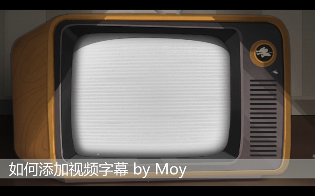
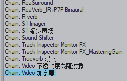

① 给视频 Item 加效果器：Video Processor

 

② 从插件的下拉菜单选择 Title Text Overlay

 

③ 修改脚本内容：

text="" 引号内是字幕显示的文字

font="" 是字幕的字体

 

修改完毕后按 Ctrl+S 保存即可生效。

 

注意：

由于编辑器缺陷，无法直接在编辑框中输入中文，需要先打好字之后粘贴进来。

粘贴后在编辑框显示有问题，但是视频画面中是正常的。

 

④ 添加后效果：

 

 

 

Tips：

把这个“字幕插件”存成插件链（Fx Chain）以后，就可以像添加普通效果器一样直接一键加字幕。

 

 ↓ 添加的时候直接从 FX Chain 目录选择

 

 