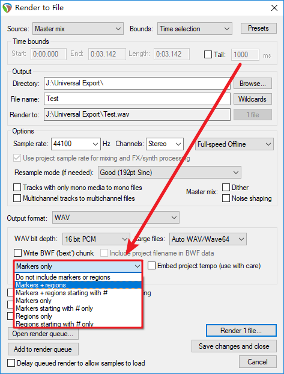
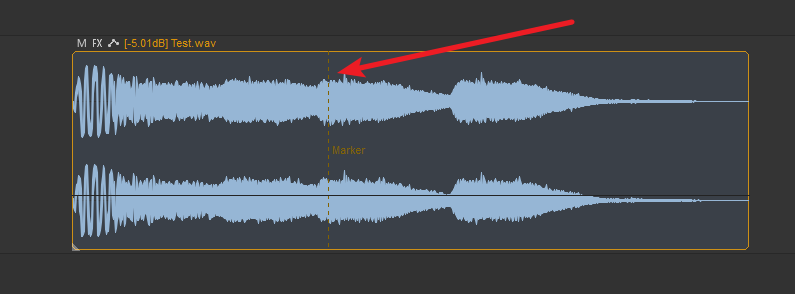
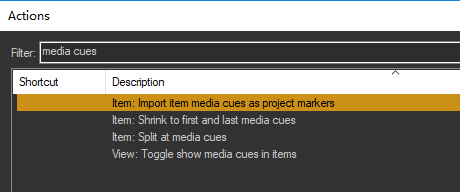

# REAPER 中的对象标记说明

## 导出带标记的音频

今天微信上被问到一个问题：
REAPER 能导出带标记的音频吗？

答案：可以。

如图，在导出 wav 文件的时候，找到「Do not include markers or regions」，从下拉菜单选取需要的选项即可。

> 菜单中的选项含义：
> * Do not include markers or regions：不嵌入标记信息
> * Markers + Regions：同时嵌入标记和区域信息
> * XXX Starting with #：以井号开头的标记或区域，如 #Start

这样设置完之后，导出的音频就会带有**工程中的**标记/区域。
音频中的标记在其他的软件（如 Audition 中）能被正常读取。

## 导入带标记的音频

但是，之所以专门写一篇文章——除了说明上述*导出带标记文件*的方法外——还想再稍微深入一点的聊聊这个`对象标记`。

首先，REAPER 原生只认工程结构上的 Marker 和 Regions，作为面向多轨编辑的 DAW，它对音频内部的嵌入标记有一套区别于工程标记的方法。
这些内嵌标记会被识别为 Item 内的 `Media Cues` ——视觉上表现为 Item 中的虚线。

好消息是，如果你想利用好 Media Cues 也有方法：将它转换为工程的标记（Project Marker）。

方法如下：

在动作列表中找到`Item: Import item media cues as project markers`，执行该动作即可从 Item 内嵌的标记生成工程标记。

与之类似的，还有几个功能，分别是：

* Item: Shrink to first and last media cues：将 Item 收束至首尾标记范围之间
* Item: Split at media cues：将 Item 依据 Media Cues 进行分割
* View: Toggle show media cues in items：切换是否显示 Media Cues 的虚线

### 不同软件间的标记识别问题

Audition 可以识别 REAPER 导出的内嵌标记，包括位置和名称；
REAPER 仅能识别 Audition 导出内嵌标志的位置，名称会丢失；
REAPER 可以完整识别自己导出的内嵌标记，包括位置和名称。

## 支持标记的音频格式

另外还有关于格式的问题，在此也小小提一下：
**REAPER 只支持写入/读取 wav 格式的标记信息。**

当你导入一个带标记的 mp3 文件时，它无法识别标记信息；
同样地，在导出 mp3 文件时，也无法选择写入标记。

Tips： 
虽然没办法直接导出带标记的 mp3 文件，但是你可以先导出 wav，再使用其他软件转换格式。

以上，这就是本期的小知识讲解。

---

Note：需要3张配图

1. 渲染窗口的设置
2. Media Cues 视图
3. Action List 截图