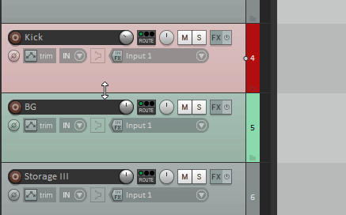
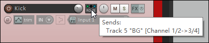
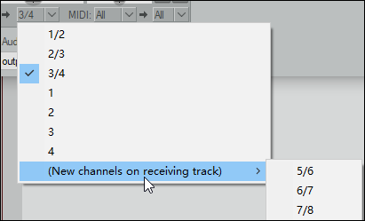
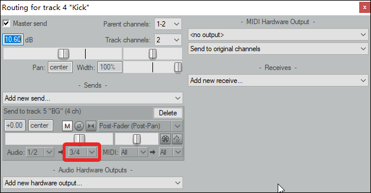
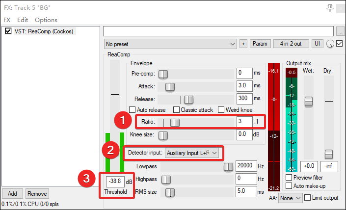

# 超简单的侧链压缩方式！——如何在 REAPER 中制作侧链压缩效果

嗨，大家好，欢迎收看写给所有人 REAPER 指南。
本期介绍的内容特别简单，也非常实用，那就是——**侧链压缩**。

如果有同学不知道这是啥，简单粗暴一句话概括：
让你的 B 轨道根据 A 轨道的电平进行音量的压缩（闪避）。

**最常见的「闪避效果」举例**：电台节目中，背景音乐可以自动随着主播说话而减弱，在主播不说话的时候自动恢复。

## 制作方法

**第一步，将 A 轨道发送到 B 轨道。**
最简单的发送方式就是：按住 Route 按钮，左键拖动到 B 轨道。

这时候 Route 按钮会产生变化：

点击 Route 按钮，就可以打开轨道的路由设置。

**第二步，设置发送的通道，默认是 1/2，我们需要手动新建并设置到 3/4。**

**第三步，在 B 轨道（接收轨）上挂载 REAPER 自带的 ReaComp 效果器。**
将效果器按照下图设置：

重点是标号的三个区域：

1. Ratio：压缩率，填写的数字越大压缩越狠
2. Detector Input：检测来源，**需要设置成第二项 Auxiliary Input**
3. Threshold：阈值，即音量超过多少 dB 时开始压缩

总的来说，B 被压缩了多少主要由「Ratio」和「Threshold」控制，而 Ratio 上方「Attack」和「Release」则是控制压缩效果的时长，Release 越大，压得就越久。

图中只是效果较明显的一种设置，具体的参数可以自行调节。

以上！
