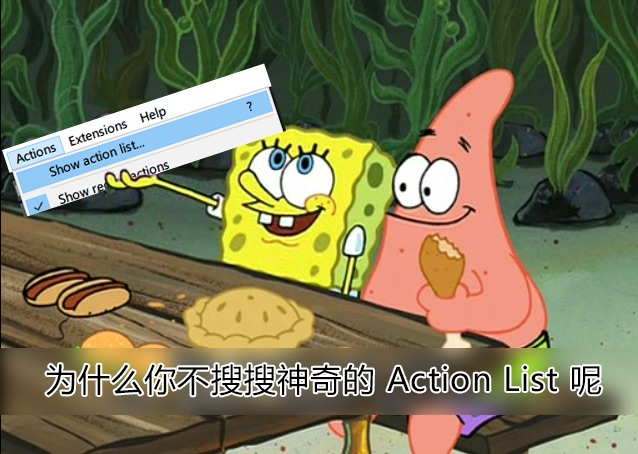
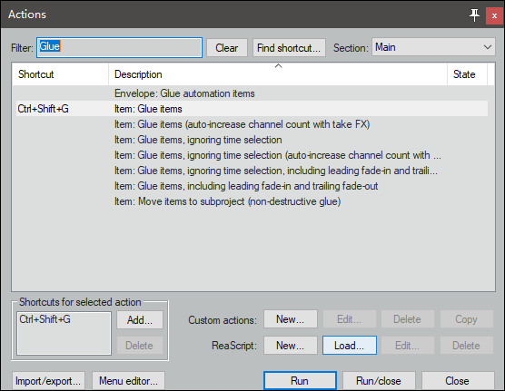
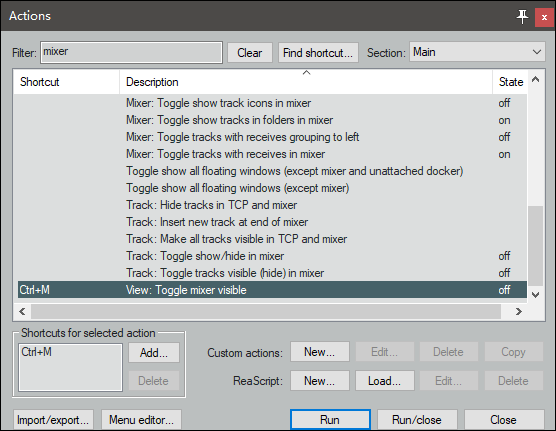
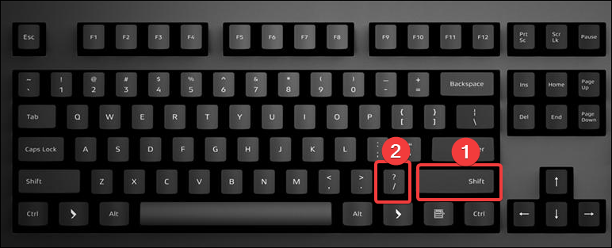
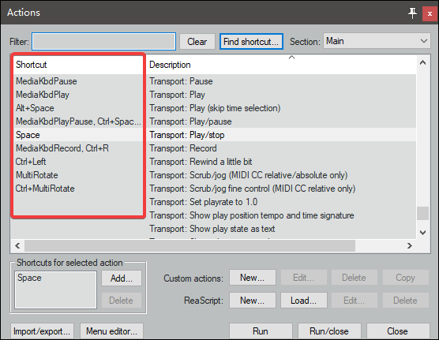
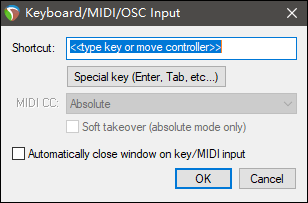
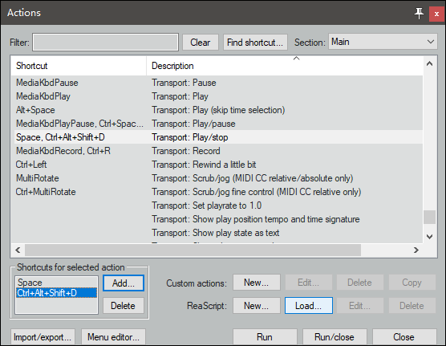
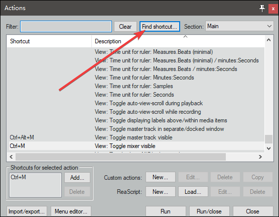
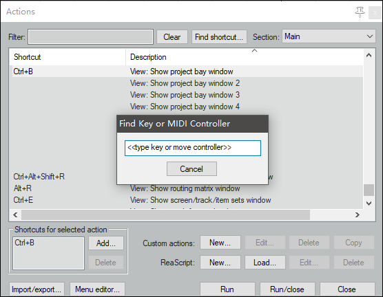
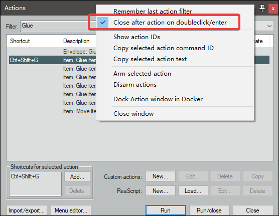

# REAPER 基础：万能的动作列表——Action List

嗨，大家好，欢迎收看写给所有人 REAPER 指南。
本期介绍的是 REAPER 最重要的基础知识。**新手必看！**

很多人在询问基础问题的时候，会出现这样一个场景：

> 提问者：怎么做到粘合两个对象？
>
> 回答者：用 Glue
>
> 提问者：Glue 是什么？在哪里？
>
> 回答者：搜 Action List 吧

或者是：

> 提问者：怎么查看所有标记的列表？
>
> 回答：打开 Marker Manager
>
> 提问者：从哪里打开？
>
> 回答者：为什么不搜搜神奇的 Action List 呢.jpg
>
> 
>
> *图片 by Ryusa*

今天，我就要交给各位初入 REAPER 的新手一个**万能卷轴**。

获得这个万能卷轴之后，你就能掌握 REAPER 中所有的动作、操作、窗口、设置……再也不需要问出「xxx 在哪」这样的问题。

没错，这个卷轴就是——**Action List **。

## ▌ ① 什么是 Action List？

Action List （动作列表）是 REAPER 内置的一个窗口。

**这个窗口中列出了所有 REAPER 内的功能和操作（统称为”Action“）。**

借助 AL 你可以轻易地解决「怎么做 xx 操作」、「怎么打开 xx 窗口」这样的问题。

比如说，别人告诉你”Glue“可以粘合两个对象，

你就可以直接打开 AL，然后搜索 ”Glue“。

然后你能找到 **Item: Glue items**，这是针对 Items 的一项操作，用来将两个 Item 粘合在一起。

**只要双击这条动作，就能执行对应的操作。**

而当你想找到某个窗口（如混音台 Mixer）的时候，同样可以直接搜索：

图中的 **View: Toggle mixer visible** 就是开关显示混音台的动作。

*注：显示/隐藏某个窗口的动作通常都是以 View 开头。*

这种带有 State 状态的动作，都是可开关的——双击会变成 on，也就是「显示混音台」，再次双击变为 off 即关闭。

>  Action List 执行完动作后会自动关闭窗口，如果不想关闭，[点此查看设置](#jump1)。

同时，Action List 还承担了一个作用：

**查找和编辑快捷键**——这个我们放在下面第三部分细说。

## ▌ ② 怎么打开 Action List ？

打开 Action List 最普通的方法，就是点击上方菜单栏的 Action 菜单。

选择第一项：<u>Show action list...</u> 即可打开。

这个时候，你会注意到，这条选项的快捷键是「？」。

这是什么意思呢？

——这是更为直观的一种呼出 Action List 的方式。

**在 REAPER 中输入「问号」。**

> 如果有不会打问号的，按如下操作：
>
> 
>
> 1. 按住 Shift 键不放
> 2. 按下 / 键

怎么样，是不是成功叫出动作列表啦？

这就是 RP 中非常有趣的一个设定……

**当你产生疑惑的时候，直接敲击问号，就可以召唤出 Action List 来解决你的问题。**

## ▌ ③ 如何利用 Action List 编辑快捷键？

正如上文所说，Action List 除了能方便你快速定位动作以及窗口之外，还可以用来编辑和查看快捷键。

Action List 左侧的第一栏 Shortcuts 就是这个操作对应的快捷键。

如果你想修改或者添加快捷键，在左下角找到这块区域：

点击 Add 按钮，会弹出快捷键输入框：

此时，按下你想要设定的快捷键组合就可以。

正如窗口标题中所说的——**支持键盘、MIDI、OSC 的输入方式**。如果想设定 MIDI 键盘或控制器的按键，也可直接进行输入。

设定完后点击 OK，新的快捷键就添加好啦。

而如果你想确定某个快捷键的具体功能，则可以用上方的 Find Shortcut... 按钮。

点击这个按钮后，同样会弹出一个按键输入框。

此时输入某个按键，它就会自动定位到该快捷键对应的操作。

很多新手在刚入门 RP 的时候，会觉得鼠标滚动操作很不习惯。

但 REAPER 的优势之一就在于：**如果你不习惯某个操作，你可以把它改成自己习惯的方案。**

鼠标亦然，在 AL 中搜索「<u>Mousewheel</u>」即可找到关于鼠标滚轮的操作。

限于篇幅这里不详细说，下次会专门写篇文介绍。感兴趣的可以自己先行探索。

对了，设置快捷键的时候注意一点：

**Action List 存在「作用范围」的设定，也就是右上角的「Section」。**

点开 Section 下拉菜单，你可以看到不同的显示界面：

Main 即主界面，Media Explorer 即媒体管理器，MIDI Editor 是 MIDI 编辑器……

针对每个界面，它们都有一套自己的快捷键体系。

内容也可能有所差异，例如 Media Explorer 中就会多出来许多关于媒体预览相关的操作。

如果你发现不同界面，鼠标滚轮的操作不同，那么就可以在这里切换到对应的 Section 进行调整。

## Tips：如何设置 Action List 执行后不自动关闭？

在 Action List 窗口的空白处点击右键，找到菜单第二项「Close after action on doubleclick/enter」。

把这个勾选**取消掉**，就可以不自动关闭。

---

## 总结

这就是本期的 REAPER 基础知识分享。

当你掌握了 Action List 之后，绝大多数问题都可以迎刃而解。

但这其实只是最基础的介绍，关于 Action List 还可以拓展出几个内容：

* 调整鼠标滚轮操作
* 创建/加载脚本
* 创建自定义动作
* 如何导出/导入按键配置（RP 的各种导出项介绍）

这些内容会在之后依次进行说明。

以上。